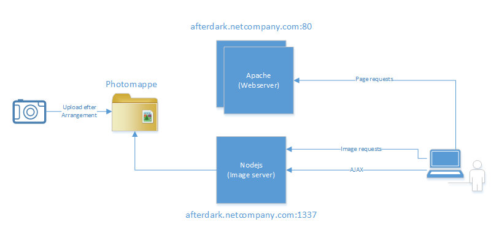

##Concept

##ImageServe
Serves pictures and domains, years, events and image lists in JSON format. Pictures are automatically rescaled and cached.

* Install http://www.graphicsmagick.org/
* Run `npm install`
* Invoke application with `node init.js`
* (Images should be placed in "images" folder)

##FrontEnd
Website that presents events and images from the imageServe server.
* Run `npm install`
* Run `bower install`
* Run `grunt build` to create build package in dist/ folder
* Run `grunt serve` to start local server on port 9000